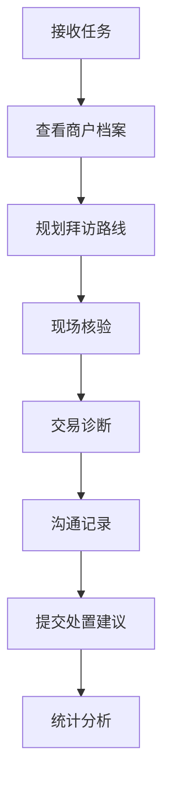

## 1. Product Overview
商户交易风险巡检助手是一款面向支付公司风控外勤和商户运营人员的移动应用，帮助他们高效完成商户风险核查工作。通过任务管理、商户档案、现场核验、交易诊断、沟通记录和处置统计等功能模块，实现风险巡检全流程数字化管理。

## 2. Core Features

### 2.1 User Roles
| Role | Registration Method | Core Permissions |
|------|---------------------|------------------|
| 风控外勤人员 | 内部账号登录 | 接收任务、现场核验、提交处置建议 |
| 商户运营人员 | 内部账号登录 | 查看商户档案、交易诊断、统计分析 |

### 2.2 Feature Module
1. **任务模块**：待核查商户列表、优先级排序、拜访路线规划
2. **商户档案模块**：营业信息、收单费率、历史交易、投诉记录
3. **现场核验模块**：门头拍照、收银台拍照、执照上传、终端编号记录
4. **交易诊断模块**：异常峰值检测、夜间交易监控、退款偏高预警、分单识别、疑似套现提示
5. **沟通记录模块**：访谈要点记录、整改要求、承诺日期设定
6. **处置模块**：限额申请、暂停结算、复查安排、解除预警
7. **统计模块**：完成率统计、风险类型分布、个人绩效展示

### 2.3 Page Details
| Page Name | Module Name | Feature description |
|-----------|-------------|---------------------|
| 任务列表 | 任务模块 | 显示待核查商户列表，支持优先级筛选，提供地图路线规划 |
| 商户详情 | 商户档案模块 | 展示商户基本信息、收单费率、历史交易趋势和投诉记录 |
| 现场核验 | 现场核验模块 | 拍照上传门头、收银台、营业执照，扫描终端编号 |
| 交易诊断 | 交易诊断模块 | 可视化展示异常指标，提供风险评估报告 |
| 沟通记录 | 沟通记录模块 | 记录访谈要点，设定整改要求和承诺日期 |
| 处置中心 | 处置模块 | 提交限额、暂停结算等处置措施，跟踪处置状态 |
| 统计报表 | 统计模块 | 展示完成率、风险分布和个人绩效数据 |

## 3. Core Process

## 4. User Interface Design
### 4.1 Design Style
- **主色调**：深蓝色(#1e3a5f)作为主色，搭配橙色(#f97316)作为警示色
- **按钮风格**：圆角矩形，渐变背景，悬停效果
- **字体**：使用 Inter 字体，标题加粗，内容清晰可读
- **布局风格**：卡片式布局，信息层级分明
- **图标风格**：使用 Lucide 图标库，简洁现代

### 4.2 Page Design Overview
| Page Name | Module Name | UI Elements |
|-----------|-------------|-------------|
| 任务列表 | 任务模块 | 优先级标签（高/中/低）、地图组件、任务状态筛选 |
| 商户详情 | 商户档案模块 | 信息卡片、交易图表、投诉列表 |
| 现场核验 | 现场核验模块 | 拍照按钮、图片预览、表单输入 |
| 交易诊断 | 交易诊断模块 | 异常指标卡片、趋势图表、风险评分 |
| 沟通记录 | 沟通记录模块 | 文本输入框、日期选择器、附件上传 |
| 处置中心 | 处置模块 | 操作按钮组、状态流程图、审批进度 |
| 统计报表 | 统计模块 | 数据卡片、饼图、柱状图、排行榜 |

### 4.3 Responsiveness
- 移动端优先设计，支持竖屏操作
- 触控优化，按钮尺寸适合手指点击
- 响应式布局，适配不同屏幕尺寸

### 4.4 3D Scene Guidance
不适用

## 5. Data Requirements
### 5.1 任务数据
- 任务ID、商户ID、商户名称、优先级、状态、创建时间、截止时间

### 5.2 商户档案数据
- 商户ID、名称、地址、营业执照号、联系人、收单费率、开户日期

### 5.3 交易数据
- 交易ID、商户ID、交易金额、交易时间、交易类型、退款金额

### 5.4 现场核验数据
- 核验ID、商户ID、门头照片、收银台照片、执照照片、终端编号

### 5.5 沟通记录数据
- 记录ID、商户ID、访谈要点、整改要求、承诺日期、记录人

### 5.6 处置数据
- 处置ID、商户ID、处置类型、处置金额、状态、审批人

### 5.7 统计数据
- 完成率、风险类型分布、个人绩效得分