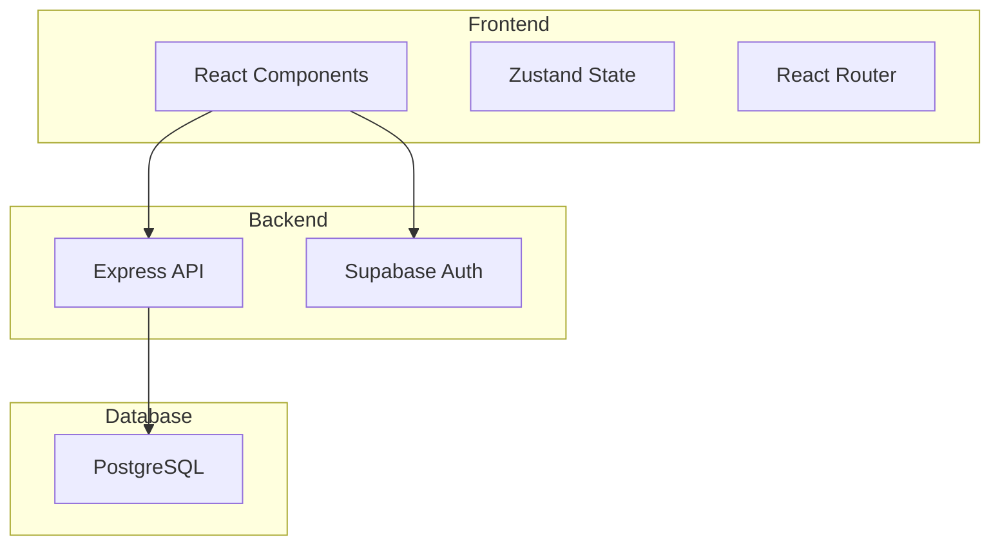
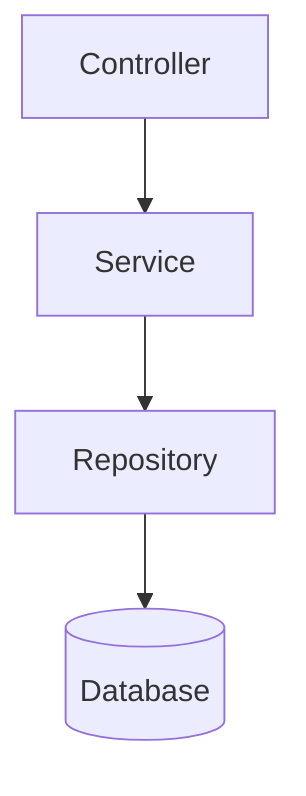
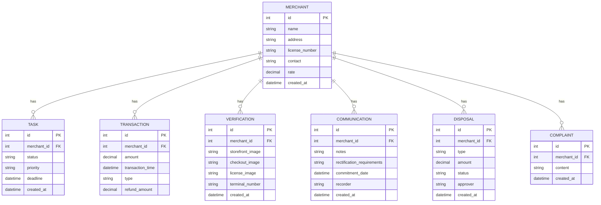

## 1. Architecture Design


## 2. Technology Description
- Frontend: React@18 + TypeScript + TailwindCSS@3 + Vite
- State Management: Zustand
- Routing: React Router DOM
- Icons: Lucide React
- Charts: Chart.js + react-chartjs-2
- Backend: Express@4 + TypeScript
- Database: SQLite (development) / PostgreSQL (production)
- Initialization Tool: vite-init

## 3. Route Definitions
| Route | Purpose | Component |
|-------|---------|-----------|
| /tasks | 任务列表页面 | TasksPage |
| /tasks/:id | 任务详情页面 | TaskDetailPage |
| /merchants | 商户列表页面 | MerchantsPage |
| /merchants/:id | 商户档案详情 | MerchantDetailPage |
| /merchants/:id/verify | 现场核验页面 | VerifyPage |
| /merchants/:id/diagnosis | 交易诊断页面 | DiagnosisPage |
| /merchants/:id/communication | 沟通记录页面 | CommunicationPage |
| /merchants/:id/disposal | 处置中心页面 | DisposalPage |
| /statistics | 统计报表页面 | StatisticsPage |

## 4. API Definitions

### 4.1 任务相关 API
| Method | Endpoint | Description |
|--------|----------|-------------|
| GET | /api/tasks | 获取任务列表 |
| GET | /api/tasks/:id | 获取任务详情 |
| PUT | /api/tasks/:id/status | 更新任务状态 |

### 4.2 商户相关 API
| Method | Endpoint | Description |
|--------|----------|-------------|
| GET | /api/merchants | 获取商户列表 |
| GET | /api/merchants/:id | 获取商户详情 |
| GET | /api/merchants/:id/transactions | 获取商户交易记录 |
| GET | /api/merchants/:id/complaints | 获取商户投诉记录 |

### 4.3 现场核验 API
| Method | Endpoint | Description |
|--------|----------|-------------|
| POST | /api/verification | 创建核验记录 |
| GET | /api/verification/:id | 获取核验记录 |

### 4.4 交易诊断 API
| Method | Endpoint | Description |
|--------|----------|-------------|
| GET | /api/diagnosis/:merchantId | 获取商户交易诊断 |

### 4.5 沟通记录 API
| Method | Endpoint | Description |
|--------|----------|-------------|
| GET | /api/communication/:merchantId | 获取沟通记录 |
| POST | /api/communication | 创建沟通记录 |

### 4.6 处置 API
| Method | Endpoint | Description |
|--------|----------|-------------|
| POST | /api/disposal | 提交处置申请 |
| GET | /api/disposal/:merchantId | 获取处置记录 |

### 4.7 统计 API
| Method | Endpoint | Description |
|--------|----------|-------------|
| GET | /api/statistics/completion | 获取完成率统计 |
| GET | /api/statistics/risk-distribution | 获取风险类型分布 |
| GET | /api/statistics/performance | 获取个人绩效 |

## 5. Server Architecture Diagram


## 6. Data Model

### 6.1 Data Model Definition


### 6.2 Data Definition Language

```sql
CREATE TABLE merchants (
    id INTEGER PRIMARY KEY AUTOINCREMENT,
    name VARCHAR(255) NOT NULL,
    address VARCHAR(500),
    license_number VARCHAR(100),
    contact VARCHAR(100),
    rate DECIMAL(10,4),
    created_at DATETIME DEFAULT CURRENT_TIMESTAMP
);

CREATE TABLE tasks (
    id INTEGER PRIMARY KEY AUTOINCREMENT,
    merchant_id INTEGER,
    status VARCHAR(20) DEFAULT 'pending',
    priority VARCHAR(20) DEFAULT 'medium',
    deadline DATETIME,
    created_at DATETIME DEFAULT CURRENT_TIMESTAMP,
    FOREIGN KEY (merchant_id) REFERENCES merchants(id)
);

CREATE TABLE transactions (
    id INTEGER PRIMARY KEY AUTOINCREMENT,
    merchant_id INTEGER,
    amount DECIMAL(15,2),
    transaction_time DATETIME,
    type VARCHAR(20),
    refund_amount DECIMAL(15,2) DEFAULT 0,
    FOREIGN KEY (merchant_id) REFERENCES merchants(id)
);

CREATE TABLE verifications (
    id INTEGER PRIMARY KEY AUTOINCREMENT,
    merchant_id INTEGER,
    storefront_image TEXT,
    checkout_image TEXT,
    license_image TEXT,
    terminal_number VARCHAR(50),
    created_at DATETIME DEFAULT CURRENT_TIMESTAMP,
    FOREIGN KEY (merchant_id) REFERENCES merchants(id)
);

CREATE TABLE communications (
    id INTEGER PRIMARY KEY AUTOINCREMENT,
    merchant_id INTEGER,
    notes TEXT,
    rectification_requirements TEXT,
    commitment_date DATETIME,
    recorder VARCHAR(100),
    created_at DATETIME DEFAULT CURRENT_TIMESTAMP,
    FOREIGN KEY (merchant_id) REFERENCES merchants(id)
);

CREATE TABLE disposals (
    id INTEGER PRIMARY KEY AUTOINCREMENT,
    merchant_id INTEGER,
    type VARCHAR(50),
    amount DECIMAL(15,2),
    status VARCHAR(20) DEFAULT 'pending',
    approver VARCHAR(100),
    created_at DATETIME DEFAULT CURRENT_TIMESTAMP,
    FOREIGN KEY (merchant_id) REFERENCES merchants(id)
);

CREATE TABLE complaints (
    id INTEGER PRIMARY KEY AUTOINCREMENT,
    merchant_id INTEGER,
    content TEXT,
    created_at DATETIME DEFAULT CURRENT_TIMESTAMP,
    FOREIGN KEY (merchant_id) REFERENCES merchants(id)
);
```

## 7. Project Structure

```
src/
├── components/          # 通用组件
│   ├── Layout.tsx      # 布局组件
│   ├── Sidebar.tsx     # 侧边栏导航
│   ├── BottomNav.tsx   # 底部导航(移动端)
│   ├── Card.tsx        # 卡片组件
│   ├── Button.tsx      # 按钮组件
│   └── ...
├── pages/              # 页面组件
│   ├── TasksPage.tsx
│   ├── TaskDetailPage.tsx
│   ├── MerchantsPage.tsx
│   ├── MerchantDetailPage.tsx
│   ├── VerifyPage.tsx
│   ├── DiagnosisPage.tsx
│   ├── CommunicationPage.tsx
│   ├── DisposalPage.tsx
│   └── StatisticsPage.tsx
├── store/              # Zustand 状态管理
│   ├── tasks.ts
│   ├── merchants.ts
│   └── statistics.ts
├── api/                # API 调用
│   ├── tasks.ts
│   ├── merchants.ts
│   ├── verification.ts
│   ├── diagnosis.ts
│   ├── communication.ts
│   ├── disposal.ts
│   └── statistics.ts
├── types/              # TypeScript 类型定义
│   └── index.ts
├── utils/              # 工具函数
│   └── index.ts
├── App.tsx
├── main.tsx
└── index.css
```

## 8. Security Considerations
- 使用 JWT 令牌进行用户认证
- API 请求需携带 Authorization header
- 敏感数据传输使用 HTTPS
- 图片上传限制大小和格式
- 输入数据进行验证和清理